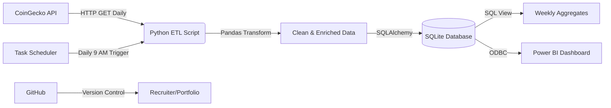

# 🚀 Real-Time Crypto/Stock Market Data Engineering Pipeline


---

## 📊 Architecture Diagram



---

## 🧠 Project Overview

This project is a **production-grade data engineering pipeline** that:

| Feature         | Description                                                                                  |
| --------------- | -------------------------------------------------------------------------------------------- |
| 📥 **Extract**   | Fetches live cryptocurrency prices (BTC, ETH, SOL) from CoinGecko API                        |
| 🔄 **Transform** | Cleans data, handles nulls, engineers features (rolling averages, volatility, daily returns) |
| 💾 **Load**      | Stores processed data in a SQL database with star-schema design                              |
| 📊 **Visualize** | Interactive Power BI dashboard for real-time insights                                        |
| ⏰ **Automate**  | Windows Task Scheduler runs the entire pipeline daily at 9 AM                                |

**Why This Matters:** Companies build systems exactly like this to monitor market trends, make investment decisions, and track business metrics in real-time. This project demonstrates my ability to design, build, and automate data pipelines from scratch.

---

## 🛠️ Tech Stack

| Layer               | Technologies                                          |
| ------------------- | ----------------------------------------------------- |
| **Extract**         | Python 3.11, Requests, CoinGecko API                  |
| **Transform**       | Pandas, NumPy (rolling averages, returns, volatility) |
| **Load**            | SQLite (with upsert/MERGE logic), SQLAlchemy          |
| **Orchestration**   | Windows Task Scheduler (Airflow-ready architecture)   |
| **Visualization**   | Power BI Desktop (ODBC connection)                    |
| **Version Control** | Git, GitHub                                           |

---

## ⚙️ Setup & Installation

### Prerequisites

- Python 3.11+
- Windows OS (for Task Scheduler) or Linux (with cron)
- Power BI Desktop (for dashboard)
- SQLite ODBC Driver (for Power BI connection)

### Step 1: Clone the Repository

```bash
git clone https://github.com/HarshaNaik8/crypto-data-pipeline.git
cd crypto-data-pipeline
```

### Step 2: Create Virtual Environment

```bash
python -m venv venv
source venv/Scripts/activate   # Windows Git Bash
# OR
venv\Scripts\activate           # Windows CMD
# OR
source venv/bin/activate        # Linux/Mac
```

### Step 3: Install Dependencies

```bash
pip install -r requirements.txt
```

### Step 4: Configure Environment Variables

```bash
cp .env.example .env
```

Edit `.env` to customize symbols and database path:

```env
COINGECKO_BASE_URL=https://api.coingecko.com/api/v3
SYMBOLS=bitcoin,ethereum,solana
DB_CONNECTION_STRING=sqlite:///crypto_pipeline.db
LOG_LEVEL=INFO
```

### Step 5: Run the Pipeline Manually

```bash
python run_etl.py
```

**Expected Output:**
```
✅ Pipeline completed successfully!
Loaded 3 records into fact_market_data
```

### Step 6: Schedule Automation (Windows)

1. Open **Task Scheduler** → Create Basic Task
2. Name: `CryptoETL`
3. Trigger: **Daily** at 9:00 AM
4. Action: Start a program → Browse to `run_pipeline.bat`
5. Settings: Check **"Run task as soon as possible after a scheduled start is missed"**

### Step 7: Connect Power BI

1. Install **SQLite ODBC Driver** (64-bit)
2. Open Power BI Desktop → Get Data → ODBC
3. Select `SQLite3 ODBC Driver`
4. Connection string:
   ```
   DRIVER=SQLite3 ODBC Driver;Database=path\to\crypto_pipeline.db;
   ```
5. Load tables: `fact_market_data`, `dim_symbol`, `vw_weekly_trends`
6. Build dashboard with:
   - Line chart (price trends)
   - Cards (latest prices)
   - Slicer (symbol filter)
   - Table (weekly aggregates)

---

## 📊 Dashboard Preview

*(Add your dashboard screenshot here - see "Adding Screenshots" section below)*

**Dashboard Features:**
- 📈 **Price Trends** – Line chart with 7-day/30-day rolling averages
- 💰 **Latest Prices** – Cards showing current prices for all symbols
- 📉 **Volatility** – Track price fluctuations over time
- 📅 **Weekly Aggregates** – Summary table from `vw_weekly_trends`
- 🔍 **Slicers** – Filter by cryptocurrency symbol

---

## 📂 Project Structure

```
crypto-pipeline/
├── src/
│   ├── __init__.py
│   ├── extract.py          # API client with retry logic
│   ├── transform.py        # Feature engineering (rolling averages, volatility)
│   ├── load.py             # Upsert to SQL with transaction support
│   └── weekly_aggregate.py # SQL view for weekly trends
├── data/                   # Raw JSON & Parquet files (gitignored)
├── logs/                   # Pipeline execution logs (gitignored)
├── pipeline.py             # Orchestration script (Extract → Transform → Load)
├── run_etl.py              # Single-run entry point for Task Scheduler
├── run_pipeline.bat        # Batch file for Windows Task Scheduler
├── crypto_dash.pbix        # Power BI dashboard file
├── requirements.txt        # Python dependencies
├── .env.example            # Environment variables template
├── .gitignore              # Files/folders excluded from version control
└── README.md               # Project documentation
```

---

## 🚀 Features & Capabilities

### ✅ Implemented

- [x] **Automated ETL** – Runs daily at 9 AM via Task Scheduler
- [x] **Feature Engineering** – 7-day/30-day rolling averages, daily returns, volatility
- [x] **Star Schema** – Fact (`fact_market_data`) and dimension (`dim_symbol`) tables
- [x] **Error Handling** – Retry logic (exponential backoff), structured logging
- [x] **Upsert Logic** – Prevents duplicate records with MERGE-style operations
- [x] **Interactive Dashboard** – Power BI with live data connection
- [x] **Version Control** – Professional README with architecture diagram

### 🔮 Future Improvements

- [ ] Migrate to **Microsoft SQL Server** (Docker) for enterprise scalability
- [ ] Add **data quality tests** with Great Expectations
- [ ] Deploy to **AWS EC2** or **Azure VM** with cloud scheduling
- [ ] Implement **email/Slack alerts** on pipeline failures
- [ ] Add **more data sources** (stocks, forex, commodities)
- [ ] Real-time streaming with **Apache Kafka** or **WebSockets**

---

## 🔧 Troubleshooting

### Power BI Connection Issues

**Error:** `The connection property 'driver' cannot be used in credentials`

**Solution:** Use System DSN instead:
1. Open ODBC Data Source Administrator (64-bit)
2. Create System DSN → `CryptoDB` pointing to `crypto_pipeline.db`
3. In Power BI, connect using `DSN=CryptoDB`

### Task Scheduler Not Running

**Error:** `Task Scheduler did not launch task as it missed its schedule`

**Solution:** In Task Scheduler Properties → Settings tab, check:
- ✅ `Run task as soon as possible after a scheduled start is missed`
- ✅ `Allow task to be run on demand`

---


## 🧠 Lessons Learned: Real-World Challenges & Solutions

### Challenge 1: UPSERT Logic

**The Problem:**
Early versions of this pipeline used `INSERT` only, causing duplicate rows for the same symbol and timestamp. This broke time-series analysis and inflated record counts.

**The Solution:**
`UPSERT (UPDATE + INSERT)` logic was implemented:
- If a record with `(symbol_id, record_timestamp)` exists → UPDATE it
- If it doesn't exist → INSERT a new record
- A `UNIQUE(symbol_id, record_timestamp)` constraint prevents duplicates at the database level

**What it Teaches:**
Data engineers must always consider `idempotency` – running the same pipeline multiple times should produce the same result. UPSERT ensures your pipeline is **idempotent** and production-ready.

### Challenge 2: Daily Return & Volatility Were Always Zero

**The Problem:**  
After running the pipeline for multiple days, `daily_return` and `volatility_7d` columns remained zero. The feature engineering was not working as expected.

**Root Cause:**  
The `transform.py` script was not loading historical data from the database. It only processed the current day's data, so `pct_change()` had nothing to compare against.

**The Solution:**
1. Added a `_load_historical_data()` method that queries past records from `fact_market_data`
2. Combined historical + current data before calculating rolling features
3. Fixed connection issues by using **raw sqlite3** instead of SQLAlchemy (which caused `'Engine' object has no attribute 'cursor'` errors)

**Result:**  
After the fix, `daily_return` now shows real values. For example:
- BITCOIN: 0.7702% (Sep 2 → Sep 3), 3.058% (Sep 3 → Sep 5)
- ETHEREUM: 0.9197% (Sep 2 → Sep 3), 3.090% (Sep 3 → Sep 5)
- SOLANA: 1.6741% (Sep 2 → Sep 3), 3.262% (Sep 3 → Sep 5)

---

### Challenge 3: Duplicate Rows on Every Pipeline Run

**The Problem:**  
Running the pipeline multiple times on the same day created duplicate rows for the same symbol and timestamp, inflating record counts and breaking time-series analysis.

**Root Cause:**  
The `load.py` script was using `INSERT` only, without checking if a record already existed for that symbol and date.

**The Solution:**
1. **Daily Granularity:** Converted timestamps to `YYYY-MM-DD` format so each day has only one record per symbol
2. **UPSERT Logic:** Added `UPDATE` if a record exists, otherwise `INSERT`
3. **Database Constraint:** Added `UNIQUE(symbol_id, record_timestamp)` constraint to prevent duplicates at the SQL level

**Result:**  
The pipeline is now **idempotent** – running it 100 times on the same day produces the same result as running it once.

---

### Challenge 4: Task Scheduler Missed Scheduled Runs

**The Problem:**  
Task Scheduler showed `Event 153: Task Scheduler did not launch task as it missed its schedule` for multiple days.

**Root Cause:**  
The task was not configured to catch up missed runs when the computer was off/sleeping.

**The Solution:**  
In Task Scheduler Properties → Settings tab, checked:
- ✅ `Run task as soon as possible after a scheduled start is missed`
- ✅ `Allow task to be run on demand`

**Result:**  
Now, if the computer is off at 9 AM, the task runs immediately when powered on.

---

### Challenge 5: Power BI Cyclic Reference Error

**The Problem:**  
Power BI threw a `cyclic reference was encountered during evaluation` error when refreshing data.

**Root Cause:**  
Power BI automatically created relationships between all tables, including a direct relationship between `fact_market_data` and `vw_weekly_trends`, causing a circular dependency.

**The Solution:**  
- Deleted the direct relationship between `fact_market_data` and `vw_weekly_trends`
- Kept only the relationship `dim_symbol[symbol_id]` → `fact_market_data[symbol_id]`
- Used `vw_weekly_trends` as a standalone table (no relationship needed)

**Result:**  
Refresh works without errors, and all visuals display correctly.

---

### Challenge 6: Power BI Connection String Issues

**The Problem:**  
Power BI rejected the connection string `DRIVER=SQLite3 ODBC Driver;Database=path\to\crypto_pipeline.db;` with error: `The connection property 'driver' cannot be used in credentials`.

**Root Cause:**  
Power BI does not allow `DRIVER=` in the credential section.

**The Solution:**  
Created a **System DSN** named `CryptoDB` and connected using:
DSN=CryptoDB

**Result:**  
Power BI connects successfully to the SQLite database.

---

## 🎓 Key Takeaways for Data Engineering

| Concept                      | Why It Matters                                                                                         |
| ---------------------------- | ------------------------------------------------------------------------------------------------------ |
| **Idempotency**              | Running the same pipeline multiple times should produce the same result. Essential for production ETL. |
| **Historical Data Loading**  | Feature engineering (rolling averages, returns) requires historical context. Always load past data.    |
| **UPSERT Logic**             | Prevents duplicates and maintains data integrity. Critical for time-series databases.                  |
| **Error Handling & Retries** | APIs fail. Retry logic with exponential backoff ensures reliability.                                   |
| **Data Granularity**         | Choose the right timestamp granularity (daily vs hourly) based on your use case.                       |
| **Orchestration**            | Task Scheduler (or Airflow) ensures your pipeline runs consistently without manual intervention.       |

## 📝 Git Workflow (For This Project)

### Standard Commit Cycle

```bash
# 1. Check what changed
git status

# 2. Add changes
git add .

# 3. Commit with a meaningful message
git commit -m "feat: Add new feature"

# 4. Push to GitHub
git push
```

### Commit Message Convention

| Prefix      | Use Case                              |
| ----------- | ------------------------------------- |
| `feat:`     | New feature                           |
| `fix:`      | Bug fix                               |
| `docs:`     | Documentation (README updates)        |
| `refactor:` | Code improvement (no behavior change) |
| `style:`    | Formatting, typos                     |
| `test:`     | Adding tests                          |

---

## 👤 Author

**Harsha Naik**  
[](https://github.com/HarshaNaik8)  
[](https://linkedin.com/in/harsha-naik-361141217)

---

## 📄 License

This project is licensed under the MIT License – see the [LICENSE](LICENSE) file for details.

---

## 🙌 Acknowledgments

- [CoinGecko API](https://www.coingecko.com/en/api) – Free cryptocurrency data
- [Microsoft Power BI](https://powerbi.microsoft.com/) – Interactive visualization
- [SQLite](https://www.sqlite.org/) – Lightweight embedded database