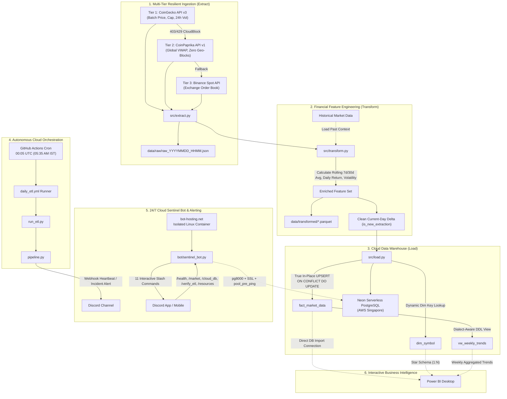
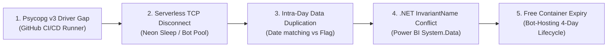

# 🚀 Enterprise Real-Time Crypto Data Pipeline & Observability Sentinel

[](https://github.com/HarshaNaik8/crypto-data-pipeline/actions)
[](https://github.com/HarshaNaik8/crypto-data-pipeline/actions/workflows/daily_etl.yml)
[](https://www.python.org/)
[](https://neon.tech/)
[](https://docs.pytest.org/)
[](https://discord.com/)
[](https://powerbi.microsoft.com/)
[](LICENSE)

An enterprise-grade, end-to-end cloud data engineering platform that automatically extracts, validates, feature-engineers, stores, monitors, and visualizes live cryptocurrency market data (Bitcoin, Ethereum, Solana).

Engineered for **100% autonomous cloud operation** ($0/month budget, zero credit cards needed), featuring a **3-tier resilient API extraction engine**, **in-place PostgreSQL/Neon UPSERTs**, **automated daily GitHub Actions cloud execution**, an **always-on 24/7 Discord Sentinel Bot** with 11 slash commands, and an **interactive Power BI Business Intelligence suite**.

---

## 🏗️ 1. End-to-End System Architecture


```mermaid
flowchart TD
    subgraph Ingestion ["1. Multi-Tier Resilient Ingestion (Extract)"]
        CG["Tier 1: CoinGecko API v3<br/>(Batch Price, Cap, 24h Vol)"] -->|403/429 CloudBlock| CP["Tier 2: CoinPaprika API v1<br/>(Global VWAP, Zero Geo-Blocks)"]
        CP -->|Fallback| BN["Tier 3: Binance Spot API<br/>(Exchange Order Book)"]
        CG --> EXT["src/extract.py"]
        CP --> EXT
        BN --> EXT
        EXT --> RAW["data/raw/raw_YYYYMMDD_HHMM.json"]
    end

    subgraph Transformation ["2. Financial Feature Engineering (Transform)"]
        EXT --> TRF["src/transform.py"]
        DB_HIST["Historical Market Data"] -.->|Load Past Context| TRF
        TRF -->|"Calculate Rolling 7d/30d Avg, Daily Return, Volatility"| ENR["Enriched Feature Set"]
        ENR --> PRQ["data/transformed/*.parquet"]
        ENR --> LOAD_READY["Clean Current-Day Delta (is_new_extraction)"]
    end

    subgraph Storage ["3. Cloud Data Warehouse (Load)"]
        LOAD_READY --> LOAD["src/load.py"]
        LOAD -->|"Dynamic Dim Key Lookup"| DIM["dim_symbol"]
        LOAD -->|"True In-Place UPSERT<br/>ON CONFLICT DO UPDATE"| FACT["fact_market_data"]
        FACT -->|"Dialect-Aware DDL View"| VIEW["vw_weekly_trends"]
        LOAD --> NEON["Neon Serverless PostgreSQL<br/>(AWS Singapore)"]
    end

    subgraph Orchestration ["4. Autonomous Cloud Orchestration"]
        CRON["GitHub Actions Cron<br/>00:05 UTC (05:35 AM IST)"] --> GHA["daily_etl.yml Runner"]
        GHA --> RUN_ETL["run_etl.py"]
        RUN_ETL --> PIPE["pipeline.py"]
    end

    subgraph Observability ["5. 24/7 Cloud Sentinel Bot & Alerting"]
        PIPE -->|Webhook Heartbeat / Incident Alert| HOOK["Discord Channel"]
        BOT_HOST["bot-hosting.net<br/>Isolated Linux Container"] --> BOT["bot/sentinel_bot.py"]
        BOT -->|"11 Interactive Slash Commands"| DISCORD["Discord App / Mobile"]
        DISCORD -->|"/health, /market, /cloud_db, /verify_etl, /resources"| BOT
        BOT -.->|"pg8000 + SSL + pool_pre_ping"| NEON
    end

    subgraph BI ["6. Interactive Business Intelligence"]
        FACT -.->|"Direct DB Import Connection"| PBI["Power BI Desktop"]
        DIM -.->|"Star Schema (1:N)"| PBI
        VIEW -.->|"Weekly Aggregated Trends"| PBI
    end
```

---

## 🎯 2. Financial Feature Engineering & Formulas

In institutional quantitative finance, decision-makers rely on continuous time-series metrics to measure momentum, assess downside risk, and dynamically adjust portfolio weights.

### Mathematical Formulations

#### 1. Daily Percentage Return ($R_t$)
Measures the exact percentage price change of an asset between consecutive days:

$$\text{Daily Return}_t = \left(\frac{P_t - P_{t-1}}{P_{t-1}}\right) \times 100$$

#### 2. Simple Moving Averages (7-Day & 30-Day SMA)
Filters out high-frequency market noise to reveal underlying intermediate and monthly price trends:

$$\text{SMA}_{k,t} = \frac{1}{k}\sum_{i=0}^{k-1} P_{t-i} \quad \text{for } k \in \{7, 30\}$$

#### 3. 7-Day Rolling Volatility ($\sigma_{7d}$)
Quantifies historical asset turbulence and market volatility exposure over a 7-day rolling window:

$$\sigma_{7d} = \sqrt{\frac{1}{n-1} \sum_{i=1}^{n} (R_i - \bar{R})^2}$$

---

## 🗄️ 3. Star-Schema Dimensional Modeling

The warehouse uses a dimensional star schema optimized for analytical query performance, strict referential integrity, and seamless BI reporting:

```
           ┌────────────────────────────┐
           │         dim_symbol         │
           ├────────────────────────────┤
           │ symbol_id (PK, SERIAL)     │◄───────────┐
           │ symbol_code (VARCHAR, UNQ) │            │ (1:N Cardinality)
           │ asset_name (VARCHAR)       │            │
           │ asset_type (VARCHAR)       │            │
           └────────────────────────────┘            │
                                                     │
           ┌────────────────────────────┐            │
           │      fact_market_data      │            │
           ├────────────────────────────┤            │
           │ fact_id (PK, SERIAL)       │            │
           │ symbol_id (FK)             │────────────┘
           │ price_usd (DOUBLE PREC)    │
           │ market_cap (DOUBLE PREC)   │
           │ volume_24h (DOUBLE PREC)   │
           │ change_24h (DOUBLE PREC)   │
           │ rolling_avg_7d (DOUBLE)    │
           │ rolling_avg_30d (DOUBLE)   │
           │ daily_return (DOUBLE PREC) │
           │ volatility_7d (DOUBLE PREC)│
           │ record_timestamp (VARCHAR) │
           ├────────────────────────────┤
           │ UNIQUE(symbol_id,          │
           │        record_timestamp)   │
           └────────────────────────────┘
                          │
                          ▼ (Analytical Materialized View)
           ┌────────────────────────────┐
           │      vw_weekly_trends      │
           ├────────────────────────────┤
           │ symbol_id, symbol_code     │
           │ asset_name                 │
           │ year_week (YYYY-WW)        │
           │ avg_price, avg_volume      │
           │ avg_volatility, price_range│
           │ record_count               │
           └────────────────────────────┘
```

### In-Place Idempotent UPSERT (`ON CONFLICT DO UPDATE`)

To prevent duplicate entries on re-runs, the pipeline executes a **True In-Place UPSERT**:

```sql
INSERT INTO fact_market_data (
    symbol_id, price_usd, market_cap, volume_24h, change_24h,
    rolling_avg_7d, rolling_avg_30d, daily_return, volatility_7d, record_timestamp
) VALUES (%s, %s, %s, %s, %s, %s, %s, %s, %s, %s)
ON CONFLICT (symbol_id, record_timestamp) 
DO UPDATE SET
    price_usd       = EXCLUDED.price_usd,
    market_cap      = EXCLUDED.market_cap,
    volume_24h      = EXCLUDED.volume_24h,
    change_24h      = EXCLUDED.change_24h,
    rolling_avg_7d  = EXCLUDED.rolling_avg_7d,
    rolling_avg_30d = EXCLUDED.rolling_avg_30d,
    daily_return    = EXCLUDED.daily_return,
    volatility_7d   = EXCLUDED.volatility_7d;
```

---

## 🌐 4. Cloud Infrastructure & Multi-Driver Database Engine

### Universal Database Engine (`create_db_engine`)
The pipeline runs seamlessly across GitHub Actions runners and containerized Linux environments through an intelligent auto-negotiation engine in `src/utils.py`:

- **Psycopg 3 (`psycopg[binary]`)**: Modern official driver for Python 3.11–3.14+ with C binary extensions. Used on GitHub Actions.
- **pg8000 (`pg8000`)**: Pure-Python PostgreSQL driver with custom SSL context. Used on bot-hosting.net containers where C compilers are unavailable.
- **Connection Resilience**: All engines are created with `pool_pre_ping=True` and `pool_recycle=300` to survive Neon Serverless sleep cycles without dropping connections.

```python
from src.utils import create_db_engine
# Auto-negotiates the optimal driver without manual dialect conversions
engine = create_db_engine(os.getenv("NEON_DB_URL"))
```

---

## 🤖 5. 24/7 Discord Sentinel Bot (`bot/sentinel_bot.py`)

Hosted 24/7 on an isolated Linux cloud container ([bot-hosting.net](https://bot-hosting.net/a)), the Sentinel Bot acts as a dedicated Command & Control Center for data pipeline observability. It connects to Neon PostgreSQL via `pg8000` with SSL and resilient connection pooling.

### Complete Slash Commands Suite (11 Commands)

| Command | Category | Description |
|---|---|---|
| `/status` | **Monitoring** | Pipeline health overview — date range, total rows, unique days, DB size. |
| `/market` | **Market Data** | Latest market snapshot — prices, 24h change, volume, market cap, 7d avg, volatility, daily return for all tracked assets. |
| `/health` | **Diagnostics** | Full-stack system health check — Neon DB status, Python runtime, environment secrets, CoinGecko API, webhook, and infrastructure telemetry. |
| `/cloud_db` | **Database** | Live Neon PostgreSQL deep-dive — connection latency (ms), active connections, storage size, table row counts, and engine version. |
| `/dbstats` | **Database** | Detailed per-table and per-symbol statistics — `dim_symbol` listing, `fact_market_data` row counts with date ranges per asset, and `vw_weekly_trends` aggregates. |
| `/history` | **Analytics** | Historical price & volatility trend for a chosen asset (BTC/ETH/SOL) — last 7 recorded days with daily return and 7d volatility. |
| `/verify_etl` | **Audit** | Verifies if today's scheduled ETL execution has completed and shows the prices loaded for each symbol. |
| `/test` | **Quality** | Runs a live 6-point integration smoke test (DB handshake, dimension integrity, fact integrity, CoinGecko/CoinPaprika/Binance API pings) with millisecond latencies. Includes a direct link to trigger the full 25-test Pytest suite on GitHub Actions. |
| `/run` | **Execution** | Triggers the ETL pipeline — dispatches GitHub Actions via REST API (if `GITHUB_TOKEN` is set), runs locally, or provides a 1-click manual trigger link. |
| `/resources` | **Navigation** | Centralized architecture hub — direct links to GitHub repo, GitHub Actions, Neon Console, Bot-Hosting panel, CoinGecko API, CoinPaprika API, Binance API, and Power BI. |
| `/help_pipe` | **Manual** | Interactive command reference listing all 11 slash commands with descriptions. |

---

## ⏰ 6. Cloud Automation & Scheduling

The cloud pipeline is configured to execute daily at **00:05 UTC (05:35 AM IST)** via GitHub Actions:
- **Optimal Crypto Market Timing:** Global cryptocurrency daily bars close at **00:00 UTC**. Running at 00:05 UTC ensures the final daily closing prices, daily returns, and trading volumes are 100% captured.
- **Zero Laptop Dependency:** Completely automated in the cloud without requiring a local machine to be turned on.
- **Bot-Hosting Renewal Reminder:** A separate GitHub Actions workflow (`bot_renewal_reminder.yml`) sends a Discord notification every 3 days reminding you to renew the free bot-hosting.net plan before its 4-day expiry.

```yaml
# .github/workflows/daily_etl.yml
name: Daily Scheduled ETL Pipeline
on:
  schedule:
    - cron: '5 0 * * *'  # 00:05 UTC = 05:35 AM IST
  workflow_dispatch:      # 1-click on-demand manual trigger
```

---

## 📊 7. Power BI Business Intelligence & Reporting (Recommended Guide)

The data warehouse connects directly to **Microsoft Power BI Desktop** (`crypto_dash.pbix`) via Import mode from Neon PostgreSQL.

### Interactive Dashboard Preview

> *Note: Place your exported Power BI screenshot at `docs/images/crypto_dashboard_preview.png` to display your custom dashboard visual above.*

### Recommended Model View (Star Schema)
- `dim_symbol[symbol_id]` → `fact_market_data[symbol_id]`
  - **Cardinality:** 1 to Many (`1:*`)
  - **Cross filter direction:** Single (`dim_symbol` filters `fact_market_data`)
- `vw_weekly_trends`: Standalone aggregated analytical view.

### Column Formatting Reference
| Table | Column | Format | Decimals | Purpose |
|---|---|---|---|---|
| `fact_market_data` | `price_usd` | Currency ($) | 2 | Asset price in USD |
| `fact_market_data` | `volume_24h` | Currency ($) | 0 | 24-hour trading volume |
| `fact_market_data` | `market_cap` | Currency ($) | 0 | Total market capitalization |
| `fact_market_data` | `rolling_avg_7d` | Currency ($) | 2 | 7-day Simple Moving Average price |
| `fact_market_data` | `rolling_avg_30d` | Currency ($) | 2 | 30-day Simple Moving Average price |
| `fact_market_data` | `change_24h` | Percentage (%) | 2 | 24h market price change percentage |
| `fact_market_data` | `daily_return` | Percentage (%) | 2 | Day-over-day mathematical percentage return |
| `fact_market_data` | `volatility_7d` | Percentage (%) | 2 | 7-day rolling standard deviation of returns |
| `fact_market_data` | `record_timestamp` | Date | Short Date | Observation timestamp (YYYY-MM-DD) |
| `vw_weekly_trends` | `avg_price` | Currency ($) | 2 | Weekly average price |
| `vw_weekly_trends` | `avg_volume` | Currency ($) | 0 | Weekly average volume |
| `vw_weekly_trends` | `price_range` | Currency ($) | 2 | Weekly high-low price spread (Max - Min) |
| `vw_weekly_trends` | `avg_volatility` | Percentage (%) | 2 | Weekly average volatility |

### Recommended Visualizations & Layout
*(The dashboard layout and visuals are customizable; the following structure is provided as an enterprise reference:)*
1. **Executive KPI Cards**: Latest Price, 24h Return (dynamic conditional green/red formatting), 7d Volatility.
2. **Asset Slicer**: Interactive tile or dropdown filter for `dim_symbol[symbol_code]` (BTC, ETH, SOL).
3. **Dual-Axis Price & Rolling Trend Line Chart**: X-Axis: `record_timestamp`, Y-Axis: `price_usd`, `rolling_avg_7d`, `rolling_avg_30d`.
4. **Weekly Market Overview Table / Matrix**: Aggregated trends from `vw_weekly_trends` (`year_week`, `avg_price`, `price_range`, `avg_volume`).

---

## 🧪 8. Automated Testing Suite (25 Tests Passing)

All core modules are tested with automated mock fixtures covering API rate limiting (HTTP 429), exponential jitter backoffs, server error retries (500/503), schema integrity, and Discord alert payloads.

```bash
$ pytest tests/ -v
============================= 25 passed in 9.95s ==============================
```

Tests run automatically on every `git push` to `main` via the CI workflow (`.github/workflows/ci.yml`).

### Comprehensive Test Catalog by Category (25/25 Tests)

#### 📡 Category 1: Observability & Alerting (`tests/test_alerts.py` — 5 Tests)
| # | Test Name | Subsystem | Assertion & Verification |
|---|---|---|---|
| 1 | `test_webhook_skipped_when_url_missing` | Webhook Config | Asserts pipeline completes without error if `DISCORD_WEBHOOK_URL` is omitted. |
| 2 | `test_webhook_successful_delivery` | HTTP Transport | Verifies successful JSON payload delivery returning HTTP 204. |
| 3 | `test_webhook_handles_network_exception_gracefully` | Resilience | Mocks socket timeout and verifies pipeline does not crash on alert drops. |
| 4 | `test_notify_success_embed_structure` | Data Contract | Validates green success embed schema (duration, record counts, asset prices). |
| 5 | `test_notify_failure_embed_structure` | Incident Telemetry | Validates crimson failure alert format (failed execution phase, error traceback). |

#### 🔄 Category 2: Multi-Tier Resilient Ingestion (`tests/test_extract.py` — 10 Tests)
| # | Test Name | Subsystem | Assertion & Verification |
|---|---|---|---|
| 6 | `test_gives_up_on_400` | Backoff Strategy | Asserts extraction gives up immediately on HTTP 400 Bad Request without futile retries. |
| 7 | `test_gives_up_on_403` | Cloud Block | Asserts immediate tier-switch on HTTP 403 Forbidden without wasting rate-limit windows. |
| 8 | `test_retries_on_429` | Rate Limiting | Verifies exponential backoff with full jitter when receiving HTTP 429 Too Many Requests. |
| 9 | `test_retries_on_500` | Server Health | Validates retry behavior when receiving HTTP 500 Internal Server Error. |
| 10 | `test_retries_on_503` | Upstream Outage | Validates retry behavior on HTTP 503 Service Unavailable. |
| 11 | `test_retries_on_network_error` | Socket Resiliency | Verifies retry on network connection drops and request timeouts. |
| 12 | `test_extract_all_returns_dataframe` | Extraction Output | Validates multi-asset extraction produces a populated pandas DataFrame. |
| 13 | `test_extract_all_has_required_columns` | Schema Validation | Confirms existence of `symbol`, `price_usd`, `market_cap`, `volume_24h`, `change_24h`, `timestamp`. |
| 14 | `test_symbol_is_uppercased` | Normalization | Asserts all asset symbols are strictly normalized to uppercase (e.g. `BITCOIN`). |
| 15 | `test_all_symbols_fail_raises` | Circuit Breaker | Asserts descriptive ValueError is raised if all three extraction tiers fail simultaneously. |

#### ⚙️ Category 3: Financial Feature Engineering & Warehouse Loading (`tests/test_transform.py` — 10 Tests)
| # | Test Name | Subsystem | Assertion & Verification |
|---|---|---|---|
| 16 | `test_basic_transform_returns_dataframe` | Transformation | Verifies raw data is successfully enriched with quantitative metrics. |
| 17 | `test_output_has_required_columns` | Feature Contract | Confirms presence of `rolling_avg_7d`, `rolling_avg_30d`, `daily_return`, `volatility_7d`. |
| 18 | `test_daily_return_is_nonzero_after_first_row` | Mathematical Logic | Validates daily return formula computation across sequential price steps. |
| 19 | `test_no_negative_volatility` | Statistical Validity | Asserts rolling standard deviation is mathematically non-negative ($\sigma \ge 0$). |
| 20 | `test_empty_dataframe_raises` | Defensive Coding | Validates pipeline halts with clear error if passed empty dataset. |
| 21 | `test_symbol_upper_cased` | Dimension Prep | Asserts symbol consistency before database foreign key mapping. |
| 22 | `test_no_nan_in_critical_columns` | Data Quality | Validates forward-fill null imputation leaves zero NaNs in financial metrics. |
| 23 | `test_load_inserts_rows` | Database Ingestion | Verifies records are successfully loaded into `fact_market_data`. |
| 24 | `test_upsert_no_duplicates` | Idempotency | Asserts repeated runs update existing records in-place without duplicating rows. |
| 25 | `test_fact_has_unique_constraint` | Relational Integrity | Verifies database enforces unique constraint on `(symbol_id, record_timestamp)`. |

---

## 🛠️ 9. Quickstart & Installation Guide

### Prerequisites
- Python 3.11+
- Git
- Neon PostgreSQL Account (free tier at [neon.tech](https://neon.tech))

### 1. Clone & Setup Virtual Environment
```bash
git clone https://github.com/HarshaNaik8/crypto-data-pipeline.git
cd crypto-data-pipeline

python -m venv venv
# Windows:
.\venv\Scripts\activate
# Linux/macOS:
source venv/bin/activate
```

### 2. Install Dependencies
```bash
pip install -r requirements.txt
```

### 3. Configure Environment (`.env`)
*(Use your own secret tokens; never commit these to GitHub!)*
```ini
# Core Configuration
COINGECKO_BASE_URL=https://api.coingecko.com/api/v3
SYMBOLS=bitcoin,ethereum,solana
LOG_LEVEL=INFO

# Cloud Database (Neon PostgreSQL)
NEON_DB_URL=postgresql+psycopg://<DB_USER>:<DB_PASSWORD>@<DB_ENDPOINT>.neon.tech/<DB_NAME>?sslmode=require

# Observability
DISCORD_WEBHOOK_URL=https://discord.com/api/webhooks/<WEBHOOK_ID>/<WEBHOOK_TOKEN>
DISCORD_BOT_TOKEN=<YOUR_DISCORD_BOT_TOKEN>
```

### 4. Execute Pipeline Locally
```bash
python run_etl.py
```

### 5. Launch Discord Sentinel Bot
```bash
python bot/sentinel_bot.py
```

---

## 📁 10. Project Structure

```
crypto-data-pipeline/
├── .github/workflows/
│   ├── ci.yml                    # CI: 25-test pytest suite on every push
│   ├── daily_etl.yml             # Daily ETL cron (00:05 UTC)
│   └── bot_renewal_reminder.yml  # 3-day Discord reminder for bot-hosting renewal
├── bot/
│   ├── __init__.py
│   └── sentinel_bot.py           # 24/7 Discord bot (11 slash commands)
├── docs/
│   └── images/
│       ├── README.md             # Instructions for dashboard screenshot
│       └── crypto_dashboard_preview.png # (Exported Power BI preview)
├── src/
│   ├── __init__.py
│   ├── extract.py                # 3-tier API extractor (CoinGecko → CoinPaprika → Binance)
│   ├── transform.py              # Feature engineering (rolling avg, volatility, daily return)
│   ├── load.py                   # Star-schema loader with UPSERT
│   ├── alerts.py                 # Discord webhook success/failure notifications
│   ├── utils.py                  # Universal DB engine, logging setup
│   └── weekly_aggregate.py       # vw_weekly_trends view refresh
├── tests/
│   ├── test_alerts.py            # Alert payload tests (5 tests)
│   ├── test_extract.py           # API extraction & retry tests (10 tests)
│   └── test_transform.py         # Feature engineering & schema tests (10 tests)
├── scripts/
│   ├── fix_machine_config.ps1    # Administrative repair script for .NET machine.config
│   ├── backfill_market_data.py   # Historical data backfill utility
│   ├── migrate_sqlite_to_postgres.py  # SQLite → Neon migration utility
│   └── migrate_add_unique_constraint.py  # Schema migration utility
├── data/
│   ├── raw/                      # Raw JSON audit trail (timestamped)
│   └── transformed/              # Parquet backups (timestamped)
├── pipeline.py                   # Core ETL orchestrator
├── run_etl.py                    # Entry point for scheduled execution
├── crypto_dash.pbix              # Power BI dashboard file
├── requirements.txt              # Python dependencies
├── .env.example                  # Environment variable template (safe placeholders)
├── LICENSE                       # MIT License
└── README.md                     # This file
```

---

## 🏆 11. Engineering Challenges, Root Cause Analyses & Production Fixes

During the development and cloud deployment of this data pipeline, several real-world distributed systems and infrastructure bottlenecks were encountered and resolved. Below is a chronological log of each engineering challenge, its root cause, and the permanent architectural solution deployed:


```mermaid
flowchart LR
    C1["1. Psycopg v3 Driver Gap<br/>(GitHub CI/CD Runner)"] --> C2["2. Serverless TCP Disconnect<br/>(Neon Sleep / Bot Pool)"]
    C2 --> C3["3. Intra-Day Data Duplication<br/>(Date matching vs Flag)"]
    C3 --> C4["4. .NET InvariantName Conflict<br/>(Power BI System.Data)"]
    C4 --> C5["5. Free Container Expiry<br/>(Bot-Hosting 4-Day Lifecycle)"]
```

### Challenge 1: Psycopg v3 Driver Missing on GitHub Actions Linux Runners
* **Problem / Symptom:** The scheduled GitHub Actions daily workflow failed in 0.16 seconds during the TRANSFORM/LOAD stage with `ModuleNotFoundError: No module named 'psycopg'`.
* **Root Cause:** SQLAlchemy 2.0 connection strings formatted with `postgresql+psycopg://` explicitly require the modern `psycopg` (v3) package, but only `psycopg2-binary` was bundled in the environment.
* **Outputs Affected:** Cloud ETL halted before data could be staged or loaded into Neon PostgreSQL.
* **Production Fix:** Engineered an auto-negotiating database factory `create_db_engine()` in `src/utils.py` that dynamically detects available drivers (`psycopg3`, `psycopg2`, `pg8000`) and rewrites dialect strings transparently. Added `psycopg[binary]>=3.1.18` to `requirements.txt`.

### Challenge 2: Neon Serverless DB Sleep & Stale TCP Connection Drops
* **Problem / Symptom:** The Discord Sentinel Bot `/health` command intermittently reported `Database: ❌ Offline` with `IndexError: list index out of range`, even though the database was active.
* **Root Cause:** Neon PostgreSQL is a serverless cloud engine that puts its compute endpoint to sleep after 5 minutes of inactivity, terminating all open TCP connections. The bot (running 24/7) held stale connections in its SQLAlchemy connection pool. When `query_db()` hit a closed socket, it caught the `OperationalError` and returned `[]`, causing `rows[0]` to raise an `IndexError`.
* **Outputs Affected:** Discord bot health checks and queries falsely reported database outages.
* **Production Fix:** Configured `pool_pre_ping=True` and `pool_recycle=300` across all database engines in `src/utils.py` and `bot/sentinel_bot.py`. SQLAlchemy now pings the database before checkout, automatically reviving sleeping endpoints without throwing exceptions. Refactored `/health` to execute `.scalar()` directly.

### Challenge 3: Intra-Day Multiple Execution Duplicate Row Accumulation
* **Problem / Symptom:** When running the pipeline multiple times within the same UTC day, the Discord success alert reported `3 / 6 Records Loaded` and listed duplicate asset prices.
* **Root Cause:** In `src/transform.py`, newly extracted rows were identified by matching `row_date == today_date`. If executed twice on the same day, previously inserted records for today matched the filter and were combined into the new insert payload.
* **Outputs Affected:** Redundant processing cycles and confusing alert summaries (though Neon's `ON CONFLICT` clause prevented corrupted database rows).
* **Production Fix:** Replaced date-matching filtering with an explicit in-memory boolean tracking flag `is_new_extraction = True` assigned to the freshly ingested API batch. Historical records are strictly tagged with `is_new_extraction = False`, guaranteeing zero duplicate processing regardless of execution frequency.

### Challenge 4: .NET System.Data InvariantName Conflict in Power BI Desktop
* **Problem / Symptom:** Power BI Desktop refresh failed on all tables with `[DataSource.Error] Column 'InvariantName' is constrained to be unique. Value 'MySql.Data.MySqlClient' is already present. (machine.config line 157)`.
* **Root Cause:** A prior local MySQL installation accidentally appended duplicate `<add>` tags for `MySql.Data.MySqlClient` inside Windows global `.NET Framework machine.config`. When Power BI's 64-bit engine initialized ADO.NET provider factories, it failed validation before establishing the PostgreSQL connection.
* **Outputs Affected:** Power BI Desktop could not import or refresh data from Neon PostgreSQL.
* **Production Fix:** Developed an automated PowerShell administrative remediation script (`scripts/fix_machine_config.ps1`) that creates a timestamped `.bak` copy of `machine.config` and uses regular expressions to purge duplicate XML provider tags.

### Challenge 5: Free-Tier Container Ephemeral Lifecycle & Idle Expiry
* **Problem / Symptom:** The Sentinel Bot on `bot-hosting.net` risked suspension every 4 days unless a manual "Renew now" button was clicked in the dashboard.
* **Root Cause:** Free-tier container hosting providers enforce activity-based renewal checkpoints to decommission unused workloads.
* **Outputs Affected:** Potential unannounced downtime of the 24/7 Discord Sentinel Bot.
* **Production Fix:** Deployed a scheduled GitHub Actions cron workflow (`.github/workflows/bot_renewal_reminder.yml`) that runs every 3 days at 09:00 UTC (14:30 IST) and posts an automated renewal alert to Discord with direct 1-click dashboard links.

---

## 👤 Author & License

**Harsha Naik**  
- **GitHub:** [@HarshaNaik8](https://github.com/HarshaNaik8)  
- **LinkedIn:** [Harsha Naik](https://www.linkedin.com/in/harsha-naik-664694292/)

Licensed under the [MIT License](LICENSE).